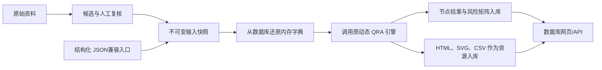

# 数据库版天然气管道人员域 QRA

数据库能力现已作为统一工程中的 `db_qra` 适配层维护。原来的
“JSON 输入 → 脚本计算 → JSON、CSV、SVG 和 HTML 文件”方式仍可独立运行。

数据库版只增加数据持久化和网页读取方式，不复制或修改 QRA 公式。实际计算仍调用原
`qra_engine.dynamic.run_dynamic_flow`，因此文件版与数据库版使用同一套动态节点、标准公式、
风险分级展示规则和数据完整度判断。

## 数据流



输入 JSON 会完整保存在 `input_snapshot.payload_json` 中，计算时自动解析成 Python 字典；
这一步等价于原文件版读取 JSON，但数据源从文件换成了数据库。同时，管段、工程指标、人口受体
和原始分类记录会投影到独立表中，便于后续检索和前端录入。

## 文件位置

- 数据库版代码：`.\src\db_qra`
- 默认数据库：`.\workspace\state\qra.sqlite3`
- 计算引擎：`.\src\qra_engine`
- 临时计算目录：`.\workspace\runtime`

临时目录只在一次计算期间存在。节点结果、风险矩阵、网页和图表成功入库后，本次临时文件自动清理。

## 最简单的运行方式

在 PowerShell 中进入统一项目目录并设置源码路径：

```powershell
$env:PYTHONPATH = "$PWD\src"
```

一步完成“JSON 入库 → 从数据库读取 → 计算 → 结果回写数据库”：

```powershell
python -m db_qra run --input ".\workspace\inputs\虚拟输入_6类最小实用数据_10管段.json"
```

启动网页服务：

```powershell
python -m db_qra serve
```

然后访问：

```text
http://127.0.0.1:8766/admin/
```

管理中心支持JSON拖拽上传、上传预检、输入快照管理、后台计算任务、管段风险排序、
资料自动转换、三栏人工复核工作台、完整报告、ZIP导出、数据库只读核查和操作审计。
资料任务通过“打开复核工作台”完成候选确认，不要求粘贴决定JSON。点击“打开报告”后，浏览器取得的
`report_dashboard.html` 和其中引用的SVG图表也全部来自数据库，不依赖原输出文件夹。

如果服务已经在运行，需要先在原PowerShell窗口按 `Ctrl+C` 停止旧进程，再重新执行
`python -m db_qra serve` 才能加载最新管理页面。

## Admin管理中心

### 上传与预检

1. 点击“上传JSON数据”，或将JSON拖入上传区域。
2. 页面先检查JSON语法、管段数量、总长度、数据类别和可运行计算节点。
3. 预检通过后选择“仅保存”或“保存并计算”。
4. 相同内容通过SHA-256自动去重，不产生重复输入快照。

预检与导入接口共用同一输入合同；非法顶层结构、空管段、重复管段编号、倒置里程、长度不一致、错误频率单位和不支持的气体组分均返回结构化400错误，且不会写入数据库。“数据类别数”与文件版能力报告采用同一权威口径。

### 计算任务

管理页面创建的任务在后台线程运行，接口立即返回 `QUEUED` 状态。页面每2秒自动刷新，
随后依次显示 `RUNNING` 和 `COMPLETED` 或 `FAILED`，因此一次计算不会阻塞其他页面操作。
本地服务最多并行执行2项计算，超出的任务保持 `QUEUED`，防止大量任务同时占满计算资源。
任务详情展示每个动态节点的完成、跳过、缺失输入和采用标准，并可打开报告或导出ZIP。

### 数据保护

- 已用于计算的输入快照不能删除，以保护输入—算法—结果审计链。
- 计算结果、风险值和报告资源在Admin数据库视图中只读。
- 大型JSON字段和二进制内容默认不在表格中展开。
- 业务数据修改通过上传新JSON形成新快照，不覆盖历史数据。
- 当前默认是仅监听 `127.0.0.1` 的本机受信模式；对外部署前必须接入企业统一认证和HTTPS。

## 分步骤运行

初始化数据库：

```powershell
python -m db_qra init
```

把结构化输入存入数据库：

```powershell
python -m db_qra import-data --input ".\workspace\inputs\虚拟输入_11类数据_10管段.json" --name "客户A第一批数据"
```

命令会返回 `snapshot_id`。按指定快照计算：

```powershell
python -m db_qra calculate --snapshot-id "返回的SNAP编号"
```

不写 `--snapshot-id` 时，自动读取最近导入的输入快照：

```powershell
python -m db_qra calculate
```

查看输入和任务：

```powershell
python -m db_qra snapshots
python -m db_qra runs
```

如需恢复成原来的文件目录，可从数据库导出某次任务的全部资源：

```powershell
python -m db_qra export --run-id "返回的RUN编号" --output-dir ".\exported_result"
```

## 数据库表及作用

| 表 | 作用 |
|---|---|
| `input_snapshot` | 不可变的完整结构化输入及 SHA-256 |
| `input_segment` | 可查询的管段几何、外径、壁厚等投影 |
| `input_indicator_observation` | 全局和分管段工程指标 |
| `input_population_receptor` | 人口、高后果目标和空间受体 |
| `input_raw_record` | 阴保、CIPS、DCVG、土壤、内检测、维修等分类原始记录 |
| `review_session` | 人工复核状态、revision、候选集合、目标节点和确认快照 |
| `review_decision` | 追加式接受、覆盖、驳回、不适用和重新提取决定 |
| `review_gate_run` | 不可变门禁结果、组装哈希、节点能力和缺数清单 |
| `reextraction_request` | 字段/来源/证据级重新提取请求状态 |
| `input_snapshot_review_provenance` | 快照到会话、门禁、决定、合同、模型和确认人的重复来源记录 |
| `calculation_run` | 一次计算任务、引擎版本、结果层级和摘要 |
| `calculation_node` | 动态节点的完成、跳过、失败和缺失输入状态 |
| `calculation_result_document` | 每个已完成计算节点的完整 JSON 结果 |
| `calculation_segment_result` | 管段 PLL、风险排序、上下界、失效频率和风险带 |
| `calculation_artifact` | HTML、SVG、CSV、JSON 等报告资源二进制内容 |
| `audit_event` | 输入导入、删除、计算排队、开始、完成、失败和导出事件 |

同一份输入 JSON 重复导入时，通过 SHA-256 返回原快照，不重复保存；每次计算仍创建新的 `RUN`，
便于比较算法版本或计算设置。

## 状态含义

- `calculation_run.status = COMPLETED`：数据库读取、引擎执行和结果入库全部成功。
- `summary.dynamic_status = PASS`：计划节点全部完成。
- `summary.dynamic_status = PARTIAL`：依据现有数据完成了可运行节点，其他节点因缺数据跳过。
- `summary.risk_result_available = true`：无论是完整 QRA 还是证据条件化筛查，已经得到管段风险值和排序。
- `formal_acceptance_judgement_allowed = false`：结果可用于筛查排序，但数据或正式准则尚不足以作风险接受性判定。

因此，六类或十一类输入数据得到 `PARTIAL` 并不表示计算失败；只表示结果覆盖范围低于完整人员域 QRA。

## 网页和 API

- `/`：跳转至企业Admin管理中心
- `/admin/`：企业Admin管理中心
- `/admin/api/overview`：运营总览指标
- `/admin/api/snapshots/preview`：上传JSON预检
- `/admin/api/snapshots/import`：输入快照入库
- `/admin/api/runs`：查询或创建后台计算任务
- `/admin/api/runs/{run_id}/segments`：管段风险排序
- `/admin/api/runs/{run_id}/export`：结果ZIP导出
- `/admin/api/database`：数据库表清单和记录数
- `/admin/api/audit`：操作审计事件
- `/admin/reviews/{conversion_job_id}/`：三栏人工复核工作台
- `/admin/api/conversions/{conversion_job_id}/review-sessions`：创建或恢复复核会话
- `/admin/api/review-sessions/{session_id}/items`：复核字段组和候选
- `/admin/api/review-sessions/{session_id}/decisions`：写入不可变复核决定
- `/admin/api/review-sessions/{session_id}/gate`：执行最终门禁
- `/admin/api/review-sessions/{session_id}/confirm`：原子创建快照及可选计算任务
- `/admin/api/review-sessions/{session_id}/evidence/{evidence_id}`：任务隔离的证据与预览
- `/runs/{run_id}/`：从数据库读取原报告网页
- `/api/snapshots`：输入快照列表
- `/api/runs`：计算任务列表
- `/api/runs/{run_id}`：任务、节点和资源清单
- `/api/runs/{run_id}/segments`：按 PLL 排序的管段风险结果
- `/api/runs/{run_id}/artifacts`：报告资源清单
- `/health`：服务状态

当前网页服务默认只监听 `127.0.0.1`，用于本机测试。如果后续部署到局域网或互联网，应在它前面增加
身份认证、HTTPS、访问审计和反向代理。

复核表的 `review_decision` 和 `review_gate_run` 由数据库触发器保护为追加式记录；
`input_snapshot` 的名称、业务JSON和业务哈希在创建后禁止更新。需要调整已确认资料时创建新的复核会话和
快照，历史计算任务继续引用旧 `snapshot_id`。完整操作、状态机和追溯说明见
[`人工复核工作台`](review-workbench.md)。

## 原文件版仍然可用

原来的命令不变，例如：

```powershell
python -m qra_engine dynamic --input ".\workspace\inputs\虚拟输入_6类最小实用数据_10管段.json" --output-dir ".\workspace\outputs\文件版测试"
```

数据库版和文件版可以并存。数据库版没有向原 `qra_engine` 源码写入数据库依赖。
