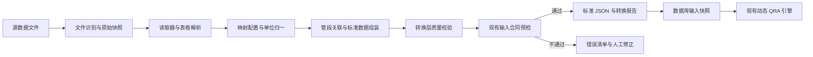

# 自动转 JSON

文档版本：v0.2  
状态：第三阶段平台集成核心链路已实现，待真实项目资料与部署权限验收  
更新时间：2026-08-25

### 第三阶段实施进度（2026-08-25）

已在管理页面接入“上传源资料/ZIP → 异步转换 → 结构化预览 → 人工确认 → 不可变快照 → 可选立即计算”完整链路。转换任务、受保护源文件、失败信息、复核审计和快照来源元数据均写入 SQLite；相同源文件集合与映射配置哈希自动去重，阻断/失败任务可以带复核决定重试，服务重启会恢复未完成任务。

快照来源现在同时记录转换任务、源文件清单与哈希、转换器版本、映射 ID/版本/哈希、JSON 哈希、确认人和确认时间。非法文件类型、ZIP 路径穿越、加密或符号链接成员、超限资料包、解析失败和合同预检失败不会生成正式快照。原有 JSON 预览、直接上传、计算、报告和导出接口保持可用。

新增批量转换 API、任务进度与结构化错误 API、本机写保护及可选 `QRA_ADMIN_TOKEN` 写入令牌。尚需用经授权真实项目资料完成网页端逐项复核，并在正式多用户部署中对接企业统一身份、角色和数据保留策略；当前令牌/本机边界不替代企业级身份权限系统。

### 第二阶段实施进度（2026-08-25）

已实现按业务主键的多文件合并、同值去重、互补字段合并、来源优先级建议、字段冲突阻断、DOCX 原生表格读取和 PDF 表格/文本辅助读取。DOCX、PDF、OCR 待处理或低置信度内容不会作为自动确认事实进入计算。

转换器现在输出转换预览和独立复核审计，预览包含已识别/未识别表格、字段来源、缺失字段、冲突、单位换算、管段关联、可运行计算节点及继续补数清单。人工决定文件必须保留复核 ID、复核人、含时区时间、原因、修改前值和修改后值；过期决定会阻断转换。

新增 `generic.multisource-review.v2` 继承式映射配置及脱敏黄金案例，覆盖 4 份来源合并、重复管段/业务记录去重、冲突先阻断后确认、字段追溯、能力盘点和确认后业务 JSON 深度一致性。尚需选择一套经授权的真实项目多来源资料，完成客户专用映射、PDF 表格提取效果和人工核对验收。

### 第一阶段实施进度（2026-08-25）

已实现 XLS/XLSX/CSV 读取、可扫描表头、版本化映射、类型与单位归一、管段 ID/里程关联、转换层质量校验、现有 `validate_import_contract` 预检、三份确定性输出和命令行入口。脱敏黄金样本已覆盖管段、工况、CIPS、人口目标和维修工单。

尚待完成的阶段验收项是：为一套经确认的真实项目源资料制作专用映射配置与人工确认目标 JSON，并逐项核对数量、里程、关键指标和人口记录。现有真实高后果区工作簿同时包含多条管线且缺少完整空间人口字段，不应在未拆分案例和补充资料的情况下强行生成可计算案例。

## 1. 建设目标

建设一个位于源数据和现有 QRA 计算引擎之间的数据转换层，将管道台账、运行工况、阴极保护、CIPS、DCVG/ACVG、内检测、人口受体、维修工单等资料，转换为计算引擎当前可以预检、保存和计算的标准 JSON。

本项目采用三个阶段实现，先解决高确定性的结构化资料，再扩展复杂资料，最后接入现有数据库与管理页面。

自动转换层只负责数据读取、字段映射、单位归一、关联、质量检查和 JSON 组装，不负责推导失效频率、补充模型默认值或作风险接受性判定。计算公式、参数选择、缺失数据下可运行节点判断及正式报告资格仍由现有计算引擎负责。

## 2. 实施边界

### 2.1 本期范围

- 读取 Excel、旧版 XLS、CSV 等结构化表格；
- 识别文件、工作表、表头、数据行和基本数据类型；
- 按配置完成源字段到标准 JSON 字段的映射；
- 统一里程、长度、压力、温度、比例、时间和坐标等单位；
- 将记录关联到管线、管段和人口受体；
- 生成标准 JSON、转换报告、来源清单和错误清单；
- 调用现有 `validate_import_contract` 进行最终预检；
- 预检通过后允许进入现有“上传 JSON → 保存 → 计算”流程。

### 2.2 暂不自动处理

- 不从缺失资料中猜测数值；
- 不把空白、未知或无法识别的数据自动替换为 0；
- 不在转换层计算生产失效频率、事件树、PLL、IR 或 F-N；
- 不由转换层把模型状态改为 `RELEASED`；
- 不允许未经人工确认的 OCR、自由文本或大模型推断结果直接进入正式计算；
- 不覆盖已经入库的历史输入快照。

## 3. 总体技术流程



核心原则如下：

1. **原始资料不丢失**：保存文件名、文件哈希、工作表、原始行号和原始值；
2. **映射可配置**：客户表头变化优先调整映射配置，不为每个文件复制一套转换代码；
3. **结果可重复**：相同源文件、相同映射版本和相同转换器版本必须生成相同 JSON 哈希；
4. **缺失必须显式**：缺失值进入转换报告，不能由转换器静默填补；
5. **计算与转换解耦**：转换器输出事实数据，计算引擎负责模型计算；
6. **版本可追溯**：JSON 结构、转换器、映射配置和源文件均保留版本或哈希。

## 4. 输出 JSON 约定

转换结果继续使用当前 `schema_version = 1.0.0` 的输入结构，不在第一阶段重新设计一套与现有引擎不兼容的格式。

### 4.1 最低必需内容

现有导入合同要求至少包含：

- `metadata`：案例编号或项目名称；
- `pipeline`：管线基础信息；
- `segments`：至少一个有效管段。

管段必须具有唯一 `segment_id`，且 `start_km < end_km`、`length_km > 0`、长度与起止里程一致。存在管线总长时，管段长度合计必须与管线总长一致。

### 4.2 可逐步补齐的内容

- `assessment`：评价日期、目的和计算设置；
- `data_category_manifest`：本次识别到的数据类别和记录数；
- `raw_data_categories`：各类源记录的标准化结果；
- `population_cells`：人口及高后果目标；
- `engineering_indicators`：按管段聚合的工程指标及来源；
- `frequency_library`、`weather_joint_probability`、`ignition_model` 等完整 QRA 输入。

资料不足时仍可生成合法 JSON，但必须由现有能力盘点明确哪些计算节点可以运行、哪些节点因缺少输入而跳过。转换完成不等于数据完整，也不等于允许作正式风险接受性判定。

### 4.3 来源追溯

每条标准化记录应尽量保留以下信息：

```json
{
  "source_ref": {
    "file_sha256": "源文件哈希",
    "file_name": "源文件名.xlsx",
    "sheet_name": "管段台账",
    "row_number": 12,
    "mapping_profile": "customer-a.pipeline-register.v1"
  },
  "quality": "A",
  "review_status": "AUTO_MAPPED"
}
```

如现有业务字段不适合直接加入上述对象，可先将完整追溯关系保存到伴随的 `conversion_report.json`，并在业务记录中保留简短 `source_ref`。不得只保留转换后的数值而丢失原始位置。

### 4.4 缺失、空值和默认值

- 源数据确实为 0：输出数值 `0`；
- 源单元格为空或未提供：省略可选字段，并记录为 `MISSING`；
- 源值含义不明确：不转换，记录为 `AMBIGUOUS`；
- 多个来源互相冲突：记录为 `CONFLICT`，默认阻断受影响字段进入计算；
- 模型默认参数：由计算引擎管理，转换器不得写成“源数据”；
- 人工修改：必须记录修改前值、修改后值、修改人、时间和原因。

## 5. 数据映射规则

### 5.1 字段识别

每一种客户模板对应一个有版本的映射配置，至少包括：

- 文件类型和工作表匹配规则；
- 表头别名，例如“起始里程”“起点桩号”“start_km”映射到同一标准字段；
- 必填字段和可选字段；
- 数据类型、允许范围和枚举映射；
- 源单位、目标单位和转换公式；
- 记录主键及去重规则；
- 管段关联规则；
- 冲突处理方式。

优先使用确定性规则。只有表头和布局无法稳定识别时才允许采用辅助智能识别，而且智能识别结果必须进入人工确认状态。

### 5.2 单位归一

目标单位以当前 JSON 字段后缀为准，例如：

- 里程和长度：`km`，坐标：`m`；
- 外径和壁厚：`mm`；
- 压力：`MPa`；
- 温度：`K`；
- 比例：`fraction`，范围为 `[0,1]`；
- 失效频率：`per_km_year`；
- 时间：ISO 8601，含时区或明确统计日期。

源单位无法确定时不得自动换算。百分号、小数比例、摄氏温度和绝对温度必须明确区分，并在转换报告中记录换算过程。

### 5.3 管段关联

记录关联管段的优先顺序为：

1. 源数据中已有且有效的 `segment_id`；
2. 根据里程落入管段范围；
3. 根据坐标与管线空间关系匹配；
4. 无法唯一匹配时转人工确认。

里程边界统一使用“起点包含、终点不包含”，最后一个管段包含终点。不得仅因为记录距离最近就强制关联；超出管线范围、落在重叠区段或存在里程断点时必须报错。

## 6. 分阶段实施

### 第一阶段：结构化表格转换 MVP

目标是跑通一条可靠的“源表格 → 标准 JSON → 现有预检”链路。

主要工作：

- 建立独立的 `qra_converter` 转换模块；
- 支持 XLS、XLSX、CSV；
- 优先支持管段台账、运行工况、阴保/CIPS/DCVG、内检测、人口目标和维修工单；
- 建立映射配置、单位转换和管段关联机制；
- 输出 `case.json`、`conversion_report.json` 和 `source_manifest.json`；
- 复用现有 `validate_import_contract`，不另建一套相互矛盾的导入规则；
- 提供命令行转换入口。

建议命令形式：

```powershell
python -m qra_converter convert `
  --source-dir ".\客户原始资料" `
  --profile "customer-a.v1" `
  --output-dir ".\converted"
```

阶段验收条件：

- 至少一套实际源资料可以稳定转换；
- 转换结果通过现有上传预检；
- 同一输入重复转换的 JSON 哈希一致；
- 管段数量、里程、长度、关键指标和人口记录与源资料逐项核对一致；
- 错误单位、重复管段、空主键、越界里程和冲突值能够被发现；
- 不存在静默补值或无法追溯的计算字段。

### 第二阶段：多来源组合与人工复核

目标是支持一个项目由多份不同资料共同组成 JSON，并处理真实资料中常见的不一致问题。

主要工作：

- 支持多文件合并、重复记录识别和来源优先级；
- 扩展更多客户模板和数据类别；
- 对可提取表格的 DOCX/PDF 提供辅助读取；
- 对 OCR、自由文本和低置信度映射增加人工确认清单；
- 提供转换预览，包括已识别字段、缺失字段、冲突、单位换算和管段关联结果；
- 根据转换结果展示可运行节点和继续补数清单；
- 建立源文件到预期 JSON 的黄金转换案例。

阶段验收条件：

- 多文件合并不会产生重复管段或重复业务记录；
- 每个关键字段均可回溯到源文件和原始位置；
- 人工确认后的修改保留完整审计记录；
- 低置信度或冲突字段不会绕过确认直接进入计算；
- 黄金案例在版本升级前后保持一致，或能够解释并批准差异。

### 第三阶段：平台集成与稳定运行

目标是在现有管理页面形成“上传源资料 → 预览转换 → 确认 → 入库 → 计算”的完整流程。

主要工作：

- 管理页面支持上传源数据文件或资料包；
- 后端创建异步转换任务，展示进度和结构化错误；
- 用户确认转换预览后才生成不可变输入快照；
- 输入快照同时记录源文件哈希、转换器版本、映射版本和 JSON 哈希；
- 相同源文件及映射版本自动去重；
- 转换成功后复用现有计算任务、报告、导出和审计能力；
- 增加批量处理、失败重试、权限和敏感数据保护。

阶段验收条件：

- 网页端完整链路可重复运行且无遗留旧状态；
- 命令行生成的 JSON 与网页生成的 JSON 一致；
- 非法源文件、解析失败和预检失败均不会写入正式输入快照；
- 转换、确认、入库和计算形成完整审计链；
- 现有 JSON 直接上传功能继续可用，不因新增转换流程而回归。

## 7. 建议代码结构

```text
qra-platform/
├─ src/qra_converter/
│  ├─ readers/          # XLS、XLSX、CSV及需复核的DOCX/PDF读取器
│  ├─ mapping/          # 表头别名、字段映射、枚举和单位转换
│  ├─ matching/         # 管段、里程和空间关联
│  ├─ validation/       # 转换层质量检查及现有合同适配
│  ├─ assembly/         # 标准JSON组装
│  ├─ reporting/        # 转换报告和来源清单
│  └─ cli.py
├─ resources/mappings/  # 按客户或模板版本管理的映射配置
├─ tests/fixtures/      # 脱敏源文件、黄金JSON和转换报告
└─ workspace/inputs/    # 本地待转换业务资料
```

读取器只负责忠实读取源数据；映射配置决定字段含义；组装器只生成标准 JSON；现有计算引擎验证器负责最终输入合同。模块之间不得相互代替，以便以后增加新模板而不修改计算引擎。

## 8. 测试与质量门槛

至少覆盖以下测试：

- 单元测试：表头识别、类型转换、单位换算、枚举、日期和空值；
- 关联测试：管段 ID、边界里程、越界记录、重叠管段和无法匹配；
- 合并测试：重复文件、重复记录、冲突来源和来源优先级；
- 合同测试：输出 JSON 必须通过现有 `validate_import_contract`；
- 黄金测试：实际脱敏源文件与人工确认的预期 JSON 深度一致；
- 确定性测试：重复转换哈希一致；
- 集成测试：转换 JSON 经文件版和数据库版计算后结果一致；
- 回归测试：保留现有 JSON 直接上传、预检失败清状态和任务计算测试。

严重级别建议统一为：

- `ERROR`：不能生成可入库 JSON；
- `WARNING`：可以生成 JSON，但需要人工确认或会降低计算层级；
- `INFO`：转换说明、单位换算和未使用字段。

## 9. 与当前人员域模型状态的关系

自动转 JSON 可以在人员域模型仍为 `IMPLEMENTED_STANDARD_FORMULAS_PROVISIONAL_VALIDATION` 时开发和使用，两者的验收目标不同：

- 转换层验收的是“源数据是否被忠实、完整、可追溯地转换”；
- 计算引擎验收的是“模型、参数和结果是否经过独立验证并允许正式使用”。

转换器不得主动设置 `formal_report_allowed`，也不得因为 JSON 成功生成就宣称模型达到 `RELEASED`。生产失效频率库、瞬态破裂模型、高压扩散验证和正式风险准则后续确定时，应通过新增可选字段、映射配置版本和必要的 `schema_version` 升级接入，而不是修改或覆盖历史 JSON。

## 10. 推荐实施顺序

第一版应选择一套具有代表性的实际源资料作为主样本，先人工制作一份经过确认的目标 JSON，再以该文件作为黄金结果开发转换器。优先把确定性高、对当前筛查结果直接有用的数据转换稳定；PDF、扫描件和自由文本等低确定性资料在第二阶段接入，并始终保留人工确认门槛。

第一阶段完成后即可接入现有计算流程开展测试。只有转换层、计算引擎以及模型正式发布条件分别通过后，系统才允许形成无人值守的正式工程评价流程。
