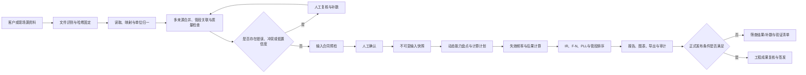

# 项目计划书

> 项目名称：天然气输送管道风险数据量化平台（Pipeline QRA Platform）
> 文档版本：v1.1
> 基线日期：2026-08-26
> 文档状态：项目总控基线（阶段 0 已执行，G0 范围门待签批）
> 当前负责人：待项目方实名指定（角色与职责已定义）
> 计划维护人：项目组

---

## 1. 文档目的

本计划书用于统一项目目标、范围、当前进度、后续路线、验收标准、角色分工和变更机制，是后续需求讨论、开发安排、数据准备、模型验证、测试验收和项目汇报的总控文件。

本文件解决以下问题：

1. 这个项目最终要解决什么业务问题；
2. 当前已经完成了什么，哪些内容只是“能运行”，哪些已经“通过测试”，哪些仍未达到“工程可用”；
3. 下一阶段应该先做什么，为什么先做；
4. 每个阶段需要交付什么，达到什么条件才算完成；
5. 领导后续增加要求时，如何纳入项目而不打乱已有工作；
6. 如何保证输入、模型、计算结果和报告可追溯、可复现、可审核。

除非形成正式的变更决定，项目组后续工作均应围绕本计划书的目标、阶段门和优先级展开。具体算法、数据合同和操作说明仍由专项文档维护，本计划书不替代专项技术文档。

---

## 2. 项目概述

### 2.1 项目背景

天然气输送管道的风险评价通常涉及管道台账、运行工况、阴极保护、CIPS、DCVG/ACVG、内检测、维修记录、历史事件、气象、人口、高后果目标、点火源等多类资料。传统工作容易出现以下问题：

- 数据分散在 Excel、CSV、Word、PDF 和资料包中，字段名称、单位和格式不统一；
- 同一项目存在多份来源，数据可能重复、冲突或缺失；
- 计算过程依赖人工整理和多个脚本，难以重复和审计；
- 数据齐全度不同时，很难明确哪些结果可计算、哪些结果不应输出；
- 测试模型、筛查结果和正式工程结论容易被混淆；
- 输入、参数、模型版本、计算结果和报告之间缺少完整追溯关系。

本项目拟建设一套天然气输送管道风险数据量化平台，把源资料转换、数据复核、风险计算、结果展示和全过程审计串联为统一流程。

### 2.2 暂定项目定位

在领导提出新增范围前，本项目按以下定位推进：

> 面向陆上埋地天然气输送管道，以人员生命风险为当前核心对象，建立“源资料—标准数据—风险模型—量化结果—报告与审计”的完整平台，实现风险数据的结构化、量化、排序、展示和可追溯管理。

当前人员域核心量化指标包括：

- 管段失效频率及其机理构成；
- 小孔、中孔、大孔和完全破裂场景频率；
- 泄漏、扩散、喷射火、闪火、蒸气云爆炸等后果指标；
- 条件死亡概率；
- 个人风险 IR；
- 社会风险 F-N；
- 潜在生命损失 PLL；
- 管段 PLL、PLL/km、最大个人风险贡献、最大后果及多维排序；
- 数据缺口、模型适用性、结果层级和正式报告阻断项。

### 2.3 项目愿景

项目最终不是只做一个“计算器”，而是形成一套可持续使用的风险量化工作体系：

1. 客户可以提交已有资料，不必先人工整理成平台 JSON；
2. 系统可以确定性地读取、映射、合并和校验资料；
3. 冲突、低置信度和缺失值必须显式呈现并由人员复核；
4. 计算引擎根据实际数据能力选择可运行节点；
5. 每个风险结果都能追溯到输入、来源、模型、参数和版本；
6. 筛查结果与正式工程评价具有清晰、强制的边界；
7. 经真实数据、外部基准、参数审批和独立复核后，平台具备工程应用条件；
8. 后续可按领导要求扩展财产、环境、供气可靠性、措施前后对比等风险域。

---

## 3. 项目目标

### 3.1 总目标

建设一套可用于天然气输送管道风险数据量化的统一平台，实现从原始资料接入到风险结果输出的闭环，并逐步达到真实项目可用、结果可验证、过程可审计和部署可运营的程度。

### 3.2 分目标

#### 目标一：数据标准化

- 建立统一、版本化的 QRA 输入数据合同；
- 支持常见结构化和文档资料转换；
- 统一字段含义、单位、枚举、缺失值和数据质量表达；
- 保留每个关键字段的来源文件、位置、时间和质量信息；
- 对重复、冲突、越界和不可识别数据设置明确门禁。

#### 目标二：风险量化

- 根据适用标准实现失效频率、泄漏后果、人员伤害和风险聚合；
- 在资料不完整时给出受控的筛查估计、数据缺口和不确定性边界；
- 在资料和模型满足条件时计算完整人员域 QRA；
- 输出管段、受体和全线多个层级的量化结果。

#### 目标三：自动化与平台化

- 形成上传、转换、复核、快照、计算、展示、导出和审计的一体化流程；
- 避免同一业务逻辑在命令行、网页和数据库版中重复实现；
- 支持任务状态、失败重试、内容去重和服务恢复；
- 支持后续部署、权限控制和多项目管理。

#### 目标四：工程验证

- 建立公式级、模块级、全链路和外部基准验证体系；
- 冻结生产参数库和项目适用准则；
- 完成至少一套真实项目数据的逐项核对与完整区段人工复核；
- 明确正式模型发布和正式报告签发条件。

#### 目标五：持续扩展

- 新标准、新算法和新数据类型通过版本化节点接入；
- 新业务要求通过变更流程纳入，不破坏历史输入和历史结果；
- 保持文档、代码、测试、模型规格和平台状态一致。

---

## 4. 项目范围

### 4.1 当前核心范围

当前版本聚焦以下内容：

1. 陆上埋地高压天然气输送管道；
2. 管段级风险单元划分和里程关联；
3. 管道完整性及失效可能性相关数据；
4. 泄漏、扩散、火灾、爆炸和人员伤害；
5. 个人风险、社会风险和潜在生命损失；
6. 管段风险排序、筛查分级和治理优先级辅助；
7. 源资料自动转 JSON；
8. 人工复核、不可变输入快照和全过程审计；
9. 动态计算任务、网页展示、图表和结果导出；
10. 模型登记、版本控制、测试和正式报告门禁。

### 4.2 可扩展范围

以下内容可以作为领导新增要求或后续二期范围，但在正式立项变更前不计入当前核心完成度：

- 财产损失及年期望损失 EAL；
- 环境释放、影响范围和恢复时间；
- 供气中断、未供气量和用户影响；
- 措施前后风险对比和风险降低量；
- 风险控制措施优化、成本效益分析；
- 蒙特卡洛不确定性传播及 P05/P50/P95；
- 在线监测数据和风险动态更新；
- GIS 风险等值线和地图服务；
- 其他介质、地上管道、站场、储罐、储气库井等资产；
- 与企业资产管理、完整性管理、数据湖或统一门户集成；
- 多租户、集团级项目管理和跨区域对标。

### 4.3 当前明确不做或不得自动做的事项

- 不从缺失资料中猜测工程事实；
- 不把空白、未知或未识别值静默替换为 0；
- 不把 OCR、自由文本或大模型推断直接作为已确认计算事实；
- 不用未经批准的测试参数冒充生产参数；
- 不因“程序运行成功”就宣称结果可用于正式工程签发；
- 不用展示性风险矩阵替代 IR 或经批准的 F-N 接受准则；
- 不覆盖历史输入快照、历史参数或历史计算结果；
- 不在没有变更批准的情况下扩展到非人员风险域并宣称已完成。

---

## 5. 关键概念和统一口径

为避免项目沟通混乱，统一采用以下口径：

| 术语 | 统一定义 |
|---|---|
| 转换成功 | 源资料已按映射规则生成符合输入合同的 JSON 草稿，不代表资料完整或模型正式可用 |
| 人工确认 | 复核人核对来源、冲突、缺失和换算后确认生成不可变快照，不代表批准风险结论 |
| 输入快照 | 经确认、以内容哈希固定、不得原地修改的一次计算输入 |
| 计算完成 | 可运行节点已执行并保存结果；可能仍为 `PARTIAL` |
| `PARTIAL` | 已完成部分算法，其他节点因缺少输入而跳过，不等于计算失败 |
| 筛查估计 | 用当前证据和受控先验形成的风险排序或区间，只用于筛查和补数优先级 |
| 完整人员域 QRA | 完整频率、空间、后果、人口和事件树主链可以运行并生成 IR、F-N、PLL |
| 模型已实现 | 公式已经编码并测试，不等于通过独立工程验证 |
| 模型已发布 | 参数、适用性、外部验证、收敛性和审批条件全部满足，可按批准用途使用 |
| 正式报告 | 使用已批准数据、模型、参数和准则，并通过复核与签发流程的工程成果 |
| 黄金案例 | 输入和预期结果由人工或权威外部工具确认，用于版本回归的固定测试案例 |

项目汇报不得用“已完成”笼统描述不同层级。应明确说明是“功能已实现”“自动化测试通过”“真实数据已验收”“外部基准已通过”或“正式模型已发布”。

---

## 6. 标准和技术依据

当前技术路线采用以下标准组合：

| 标准 | 项目中的作用 |
|---|---|
| SY/T 6891.2—2020《油气管道风险评价方法 第2部分：定量评价法》 | 管道 QRA 主框架、管段、场景、失效频率、空间离散和结果表达 |
| AQ/T 3046—2013《化工企业定量风险评价导则》 | 泄漏、扩散、点火、火灾爆炸、人员伤害、IR、F-N 和 PLL 数学模型 |
| GB/T 34346—2017《基于风险的油气管道安全隐患分级导则》 | 独立辅助计算链及个人风险参考准则 |
| GB/T 27921—2023《风险管理 风险评估技术》 | 风险识别、分析、评价和记录的一般方法依据 |

标准使用原则：

1. 每个公式必须有唯一、明确、版本化的来源；
2. 推荐值、示意图和强制准则不得混用；
3. 标准未给出的参数必须来自批准的项目参数库或经验证的外部来源；
4. 项目合同、属地法规或主管部门准则优先于平台默认展示准则；
5. 标准更新时必须新增模型或配置版本，不得静默改变历史结果。

---

## 7. 总体业务流程和系统架构

### 7.1 端到端业务流程



### 7.2 软件架构

平台采用“模块化单体 + 端口适配器”结构：

- `qra_converter`：读取、映射、合并、关联、复核和标准 JSON 草稿；
- `db_qra`：转换任务、人工确认、不可变快照、SQLite、管理页面、API、计算编排和审计；
- `qra_engine`：输入校验、动态计算节点、标准公式、风险聚合和报告生成。

依赖方向固定为：

```text
qra_converter → 标准JSON草稿 → db_qra → 已确认快照 → qra_engine
```

转换器不得调用计算公式，计算引擎不得依赖数据库，网页和命令行必须调用同一应用服务。

### 7.3 数据生命周期

1. 原始文件保留文件名、SHA-256、来源和上传时间；
2. 映射配置带 ID、版本和哈希；
3. 转换草稿记录字段来源、单位换算、缺失、冲突和复核决定；
4. 输入合同通过且经人工确认后形成不可变快照；
5. 每次计算固定输入哈希、模型版本、参数版本、节点状态和结果哈希；
6. 报告和图表与计算任务绑定；
7. 数据或模型变化时创建新快照或新任务，不覆盖历史记录。

---

## 8. 当前项目状态基线

### 8.1 基线结论

截至 2026-08-26，项目已经具备较完整的软件原型和风险筛查能力，自动转 JSON 的三阶段核心链路已经实现；阶段 0 已选定九江支线并固定首个代码基线，但实名责任人、真实资料授权、生产参数审批、真实项目资料验收、独立外部基准、关键物理模型验证和正式部署尚未完成。因此当前不能把平台描述为“已经可以无人值守签发正式工程 QRA 报告”。

### 8.2 已完成或基本完成

#### A. 工程基础

- 已形成统一 Python 工程 `qra-platform`；
- 已建立计算、转换和数据库三个模块边界；
- 已建立本地虚拟环境、启动命令、测试脚本和架构检查；
- 2026-08-25 实测架构检查通过；
- 2026-08-25 实测 103 项自动化测试全部通过。

#### B. 源资料自动转换

- 支持 CSV、XLS、XLSX；
- 支持 DOCX 原生表格和 PDF 表格/文本的辅助提取；
- 支持 ZIP 资料包及安全检查；
- 支持可扫描表头、字段别名、类型转换和单位归一；
- 支持按管段 ID 和里程关联；
- 支持多文件去重、同值合并、互补字段合并和来源优先级建议；
- 支持冲突和低置信度阻断、人工复核决定和完整审计；
- 输出业务 JSON、转换报告、来源清单和转换预览；
- 网页端已贯通异步转换、确认、快照和可选立即计算；
- 支持来源哈希、映射哈希、JSON 哈希、任务去重、失败重试和重启恢复；
- 原有直接上传 JSON 功能保持兼容。

#### C. 动态计算与风险结果

- 已建立数据能力盘点和动态计算 DAG；
- 资料不足时可以完成可运行节点并列出缺失输入；
- 已实现证据条件化筛查估计；
- 已实现完整人员 QRA 的标准公式骨架；
- 已实现 IR、F-N、PLL 和管段多维排序；
- 已实现 GB/T 34346 附录 C 独立辅助校核链；
- 已实现结果哈希、节点状态、频率守恒和正式报告门禁；
- 已生成 HTML、SVG、CSV、JSON 和 ZIP 结果资源。

#### D. 数据库和管理页面

- 已实现 SQLite 持久化；
- 已实现不可变输入快照；
- 已实现后台计算任务、状态跟踪和局部失败隔离；
- 已实现输入、管段、指标、人口、原始记录、计算节点和结果的投影表；
- 已实现管理页面、报告页面、API、导出和操作审计；
- 已实现本机写保护和可选管理令牌。

### 8.3 已实现但仍需工程验证

- 完全破裂初始泄放已实现，但瞬态降压、管存衰减、上下游补气、隔离和放空模型尚未冻结；
- 高斯烟羽扩散已接入，但高压天然气近场射流到远场扩散的适用性和切换条件尚未完成独立验证；
- 喷射火和 TNO 多能法已接入，但正式参数库和图 E.1 数字化曲线仍需独立复核；
- 立即点火和延迟点火已实现，但真实点火源及效率库仍需建立；
- 失效频率和修正因子接口已实现，但当前缺少经批准的生产频率库和项目 K_j；
- F-N 已计算，但项目尚未批准数值接受曲线，因此不自动判定社会风险等级；
- 泄漏点已经按初始间距离散，但自动加密和收敛判据尚未实现；
- 当前测试案例能够跑通全链，但主要参数为合成值。

### 8.4 尚未完成

- 一套经授权真实项目资料的专用映射配置；
- 真实资料转换后的人工确认黄金 JSON；
- 真实项目资料数量、里程、关键指标和人口记录逐项核对；
- 真实资料通过网页链路创建的正式转换任务和转换来源快照；
- 经批准的生产失效频率库、孔径比例、物性、点火和后果参数库；
- 至少一套独立外部完整算例及逐层对比；
- 瞬态破裂泄放、高压近场扩散和 TNO 曲线的工程验证；
- IR 网格与泄漏点收敛性验证；
- 经批准的项目 F-N 准则或“只计算不判定”决定；
- 真实工程数据条件下的完整报告验收；
- 企业身份认证、HTTPS、角色权限、备份恢复和数据保留策略；
- 正式发布、培训、运行维护和版本升级流程。

### 8.5 当前运行数据事实

截至本基线日期：

- 平台正式数据库中暂无通过新“源资料转换”流程建立的转换任务；
- 现有输入快照来自直接 JSON 导入；
- 现有计算结果可以作为开发和筛查演示证据，不能替代真实资料转换验收；
- 首个试点已固定为九江支线 GDBZYQ-JJ-1，边界为 JJ001（0+000）至 JJ041G（10+938）；相邻瑞昌支线和芦溪支线不纳入该案例；
- 九江现有 11 段输入是按无 GPS 现场资料变化点形成的筛查草稿，不是测绘里程、专用映射输出或已确认黄金 JSON；
- 江西天然气现有工作簿包含多条管线，且空间人口字段不完整，阶段 1 必须按九江支线过滤、核对边界并补数，不能强行自动生成完整可计算案例。

### 8.6 工作流成熟度总览

状态定义：绿色为核心功能已完成并有自动化证据；黄色为已实现但待真实数据或工程验证；红色为关键工作尚未开始或未通过验收。

| 工作流 | 当前状态 | 当前判断 | 下一验收点 |
|---|---|---|---|
| 工程架构与自动化测试 | 绿色 | 架构检查和 103 项测试通过 | 纳入持续集成并保持回归通过 |
| 自动转 JSON 通用能力 | 绿色 | 三阶段核心链路已实现 | 用真实资料完成专用映射验收 |
| 真实项目数据准备 | 红色 | 多管线混合且人口空间数据不足 | 选定一条支线并完成数据盘点和补数 |
| 真实项目转换验收 | 红色 | 尚无正式转换任务 | 黄金 JSON、逐项核对和网页闭环通过 |
| 筛查风险计算 | 绿色 | 可产生风险值、排序、矩阵和缺口 | 真实数据试算和业务解释复核 |
| 完整人员 QRA 主链 | 黄色 | 标准公式已实现并测试 | 生产参数、外部基准和收敛性通过 |
| 正式风险接受性判断 | 红色 | F-N 准则和多项模型未批准 | 项目准则审批及模型发布门通过 |
| 报告与图表 | 黄色 | 自动 HTML/SVG/CSV/ZIP 已实现 | 真实工程报告模板和签发审查通过 |
| 权限与正式部署 | 红色 | 当前为本机受信模式 | 企业认证、HTTPS、备份和运维验收 |
| 项目治理与变更管理 | 黄色 | 已有专项文档，缺少总控基线 | 本计划书启用并持续维护 |

---

## 9. 目标成熟度和完成标准

### 9.1 成熟度分级

| 等级 | 名称 | 能力描述 |
|---|---|---|
| L0 | 算法/概念验证 | 单个公式或脚本可以运行，输入输出尚未形成完整平台链路 |
| L1 | 可复现筛查平台 | 输入、计算、结果、哈希和测试可复现，可用于内部筛查和开发验证 |
| L2 | 真实数据试点 | 至少一套真实项目数据完成转换、核对、试算和业务解释验收 |
| L3 | 工程验证版 | 生产参数、独立外部基准、收敛性、准则和正式报告模板通过审批 |
| L4 | 生产运行版 | 身份权限、部署、备份、监控、运维、培训和发布机制全部建立 |

### 9.2 当前和目标

- 当前综合成熟度：L1；
- 自动转换软件能力：接近 L2，但缺真实项目验收；
- 计算模型成熟度：L1，处于公式已实现、工程验证未发布状态；
- 第一目标：完成 L2 真实数据试点；
- 当前项目建议的正式交付目标：达到 L3；
- 如领导要求上线给多用户长期使用，则增加 L4 为正式范围。

### 9.3 项目“完成”的定义

若没有后续新增范围，本项目只有同时满足以下条件才可定义为完成：

1. 至少一套代表性真实项目资料完成源文件到标准 JSON 的逐项验收；
2. 全部关键输入可追溯，无静默补值和未审计人工修改；
3. 生产参数库、模型版本和适用范围获得批准；
4. 至少一套独立完整外部算例通过预先批准的差异标准；
5. 泄漏点、IR 网格和关键物理模型完成收敛或适用性验证；
6. 项目风险接受准则获得批准，或形成正式“只计算、不判定”决定；
7. 真实数据完整报告通过技术复核和业务验收；
8. 所有 P0/P1 缺陷关闭，自动化测试和安全检查通过；
9. 用户手册、模型说明、数据字典、验收记录和发布说明齐全；
10. 若进入生产运行，部署、权限、备份、监控、培训和运维交接完成。

---

## 10. 项目阶段路线图

项目时间以 T0（本计划书获确认并启动下一阶段）为起点。以下周期是单一试点案例、关键人员和所需资料能够按时提供时的建议值；在人员、数据和外部验证资源明确后再转为固定日历计划。

| 阶段 | 建议周期 | 核心目标 | 主要里程碑 |
|---|---:|---|---|
| 阶段 0：基线冻结与试点选择 | 1 周 | 固定当前版本、范围、角色和试点案例 | M0 项目基线确认 |
| 阶段 1：真实数据转换验收 | 2～4 周 | 完成一条支线的专用映射、黄金 JSON 和网页闭环 | M1 真实资料转换验收 |
| 阶段 2：真实数据试算与差异整改 | 2～4 周 | 形成风险筛查结果、补数清单和业务解释 | M2 真实数据试点通过 |
| 阶段 3：生产模型与参数冻结 | 4～8 周 | 冻结频率、物性、点火、后果和项目准则 | M3 模型候选版本冻结 |
| 阶段 4：独立验证与收敛性 | 4～8 周 | 完成外部基准、敏感性、收敛性和独立复核 | M4 工程模型验证通过 |
| 阶段 5：正式报告与项目验收 | 3～5 周 | 形成正式报告模板和真实工程成果 | M5 L3 工程验证版验收 |
| 阶段 6：生产部署与运营 | 2～4 周 | 完成认证、HTTPS、备份、监控、培训和交接 | M6 L4 生产运行版上线 |

阶段可以部分并行，但不得绕过阶段门。例如，可以提前设计正式报告模板，但不能在模型未发布时签发正式报告。

---

## 11. 阶段详细计划

### 11.1 阶段 0：基线冻结与试点选择

#### 目标

建立所有后续工作的共同起点，避免一边开发、一边更换案例和口径。

#### 主要任务

1. 确认当前核心业务范围为天然气输送管道人员生命风险量化；
2. 指定项目负责人、业务负责人、数据负责人和模型复核人；
3. 在九江支线或芦溪支线中选定一个首个试点；
4. 固定当前代码、模型规格、映射配置和测试结果的基线版本；
5. 建立需求清单、问题清单、决策记录和风险登记册；
6. 明确真实资料的授权使用、脱敏和存储要求；
7. 明确试点验收参与人和签字方式。

#### 交付物

- 项目范围确认记录；
- 试点案例选择记录；
- 角色与职责表；
- 基线版本和测试记录；
- 初始数据清单、问题清单和风险登记册。

#### 完成条件

- 试点对象唯一且边界明确；
- 项目组知道谁提供数据、谁解释数据、谁复核模型、谁验收结果；
- 后续工作不再以混合多管线资料作为一个未拆分案例推进。

#### 执行状态（2026-08-26）

- 已完成：核心范围冻结；首个试点选定为九江支线 GDBZYQ-JJ-1；边界固定为 JJ001（0+000）至 JJ041G（10+938）；代码、模型规格、通用映射和 103 项测试基线已用 Git 提交 `66bd790a19da3432df85ce18ce64be5877137e2a` 及标签 `stage0-code-baseline-v0.8.0` 固定；需求、问题、决策、风险和初始数据登记已建立；
- 已形成规则：真实资料本地受控存储、Git 隔离、最小授权、脱敏回归和受控导出；默认采用版本化 Markdown、Git 提交哈希及必要时签署 PDF 的验收方式；
- 未完成：项目负责人、业务负责人、数据负责人、模型独立复核人和验收人尚未实名；真实资料用途、保密等级、保留期限和导出范围尚未由数据负责人书面批准；
- 阶段门：G0 当前为 `HOLD`。在实名责任人和数据授权签批完成前，可以开展只读数据盘点、内部开发和脱敏准备，不得把现有九江草稿认定为已授权黄金输入或正式 QRA 结论；
- 证据入口：`qra-platform/docs/project/stage0/README.md`。

### 11.2 阶段 1：真实数据转换验收

#### 目标

证明自动转 JSON 不仅能处理测试夹具，也能忠实处理一套真实项目资料。

#### 主要任务

1. 盘点试点管线全部源文件、工作表、字段、单位和时间范围；
2. 区分管线级、管段级、点位级、受体级和事件级数据；
3. 将多管线工作簿拆分或通过明确字段限定到试点管线；
4. 确定管段划分基线，核对起止里程、长度和边界；
5. 建立 `jiangxi-natural-gas.<line>.v1` 客户专用映射；
6. 人工制作或审核目标黄金 JSON；
7. 补齐或明确缺失的人口、坐标、昼夜分布、室内外比例等信息；
8. 执行转换，处理所有错误、冲突和低置信度项；
9. 逐项核对源文件数量、管段、里程、关键指标、人口和目标；
10. 比较命令行与网页端转换结果；
11. 在网页端完成确认，形成带转换来源元数据的不可变快照；
12. 将脱敏真实案例加入黄金回归测试。

#### 数据验收标准

- 管段编号唯一；
- `start_km < end_km`，管段长度与里程差一致；
- 管段没有未解释的重叠、断点或越界；
- 关键记录能够唯一关联到管段或明确转人工复核；
- 单位来源明确，换算过程有记录；
- 源空值保持缺失，不自动变成 0；
- 每个关键值能够追溯到源文件和原始位置；
- 所有冲突都有复核人、时间、原因、修改前值和修改后值；
- 命令行与网页端业务 JSON 深度一致；
- 相同输入和映射重复转换得到相同内容哈希；
- 非法输入和预检失败不创建正式快照。

#### 交付物

- 真实资料目录和数据盘点表；
- 客户专用映射配置 v1；
- 人工确认黄金 JSON；
- 转换报告、来源清单、复核审计和差异清单；
- 不可变输入快照；
- 真实资料脱敏回归夹具；
- 阶段验收记录。

#### 完成条件

上述数据验收标准全部满足，且业务数据负责人确认转换结果忠实反映源资料。

### 11.3 阶段 2：真实数据试算与差异整改

#### 目标

基于真实试点快照运行当前动态计算链，明确能算什么、不能算什么、结果如何解释以及还需补哪些数据。

#### 主要任务

1. 生成真实案例的数据能力报告；
2. 运行全部可用计算节点；
3. 检查每个节点的完成、跳过、失败和缺失输入；
4. 形成管段风险值、PLL/km、最大后果和主导场景排序；
5. 如满足条件，生成 IR、F-N 和 PLL；
6. 由业务人员核对高风险区段是否与现场认知和完整性证据基本一致；
7. 对异常排序开展数据、映射、参数和公式四层排查；
8. 区分“数据缺失”“参数未批准”“模型未验证”和“真实低风险”；
9. 输出按影响程度排序的补数清单；
10. 修复试点暴露的软件缺陷并增加回归测试。

#### 交付物

- 真实试点能力报告；
- 计算执行计划和动态执行清单；
- 管段风险表、风险矩阵、图表和 HTML 报告；
- 数据补充清单；
- 结果业务解释与异常排查记录；
- 缺陷整改和回归测试记录。

#### 完成条件

- 真实数据能够稳定重复运行；
- 相同输入和模型版本的数值结果哈希可复现；
- 所有跳过项和阻断项均有明确原因；
- 业务人员可以解释主要高风险管段和主导因素；
- 结果明确标记为筛查或完整 QRA，不发生层级误用。

### 11.4 阶段 3：生产模型与参数冻结

#### 目标

把测试参数替换为经批准、适用于目标管线的生产参数，并形成模型候选发布版本。

#### 主要任务

1. 确定失效频率方法和适用数据源；
2. 建立分失效机理、分孔径的首版生产频率库；
3. 审批孔径比例；
4. 冻结天然气组分、物性、燃烧热、LFL、绝热指数、泄漏系数等参数来源；
5. 建立项目 K_j 或完成校准模型参数；
6. 冻结气象联合概率和地形分类；
7. 建立点火源、立即/延迟点火概率及区域效率库；
8. 确定 VCE 拥塞、约束、爆炸源体积和强度选取规则；
9. 确定人口、昼夜、室内外、占用时段和防护修正规则；
10. 批准个人风险和社会风险使用准则；
11. 为所有参数记录责任人、版本、日期、适用范围、来源和审批状态；
12. 更新模型注册状态和正式报告阻断条件。

#### 交付物

- 生产参数库 v1；
- 失效频率及修正因子说明；
- 气体物性和燃烧参数说明；
- 气象、点火、人口和拥塞参数说明；
- 项目风险接受准则；
- 模型规格和适用性说明；
- 模型候选发布清单。

#### 完成条件

- 不再使用未标识的合成参数或临时默认值；
- 每个生产参数有来源、适用范围和批准记录；
- 参数变化能够通过版本产生新结果，不改变历史结果；
- 模型候选版本可进入独立验证。

### 11.5 阶段 4：独立验证与收敛性

#### 目标

证明模型不仅在内部测试中自洽，而且与独立可信结果具有可接受的一致性。

#### 主要任务

1. 选择经批准的外部验证来源，可包括授权软件结果、历史工程算例或权威表格；
2. 固定外部案例源文件和哈希，确保独立性；
3. 预先批准对比字段、单位、容差和差异处理规则；
4. 分层比较源项、扩散、火灾/爆炸、人员伤害、IR、F-N 和 PLL；
5. 验证完全破裂瞬态泄放和隔离逻辑；
6. 验证高压近场到远场扩散模型和切换条件；
7. 独立复核 TNO 曲线数字化；
8. 开展泄漏点间距加密和风险曲线收敛测试；
9. 开展 IR 网格分辨率和边界范围收敛测试；
10. 开展质量守恒、概率守恒、频率守恒和单调性检查；
11. 开展关键参数敏感性分析；
12. 对差异进行分类：输入差异、模型差异、数值差异或软件缺陷；
13. 由非主要开发者完成独立复核并形成结论。

#### 交付物

- 外部基准案例包和来源审批记录；
- 分层对比报告；
- 收敛性报告；
- 敏感性分析报告；
- 差异问题和关闭记录；
- 独立复核意见；
- 正式模型发布建议。

#### 完成条件

- 至少一套完整外部案例通过预先批准的验收准则；
- 关键差异均已解释或整改；
- 收敛性达到批准阈值；
- P0/P1 模型问题全部关闭；
- 独立复核人建议模型按明确适用范围发布。

### 11.6 阶段 5：正式报告与项目验收

#### 目标

把经过验证的输入、模型和结果转化为可复核、可签发的工程成果。

#### 主要任务

1. 明确正式报告目录、表格、图件、结论和签字要求；
2. 建立报告模板和字段到权威结果节点的唯一映射；
3. 展示项目概况、数据来源、评价单元、模型、参数和准则；
4. 展示失效频率、后果距离、IR、F-N、PLL 和管段排序；
5. 显式展示数据缺口、假设、不确定性和适用范围；
6. 禁止把 `null`、未计算或不适用显示为物理零；
7. 建立技术复核、质量审核和批准签发流程；
8. 使用真实试点生成完整报告并逐章验收；
9. 完成用户手册、模型说明、数据字典和验收报告。

#### 交付物

- 正式工程报告模板；
- 真实试点完整报告；
- 报告字段追溯矩阵；
- 技术复核和验收记录；
- 用户手册、数据字典和模型说明；
- L3 工程验证版发布包和发布说明。

#### 完成条件

- 报告所有关键数值可追溯到结果节点和输入快照；
- 报告结论不超出模型适用范围；
- 正式报告门禁全部通过；
- 业务、技术和质量复核意见关闭；
- 项目方完成 L3 验收。

### 11.7 阶段 6：生产部署与运营

#### 目标

如项目需要长期或多用户使用，将工程验证版转为可运营的生产系统。

#### 主要任务

1. 确定部署拓扑、环境和容量；
2. 接入企业统一身份认证；
3. 建立项目、数据、复核、计算、查看、导出和管理角色；
4. 配置 HTTPS、反向代理和网络访问边界；
5. 建立数据库备份、恢复演练和数据保留策略；
6. 建立日志、审计、健康检查、告警和容量监控；
7. 建立开发、测试、验收和生产环境；
8. 建立版本发布、回滚和变更审批；
9. 开展安全测试、性能测试和用户验收；
10. 培训管理员、数据人员、模型人员和报告使用者；
11. 完成运维手册和责任交接。

#### 交付物

- 部署架构和安全方案；
- 权限矩阵；
- 备份恢复和监控方案；
- 安全与性能测试报告；
- 运维手册和培训材料；
- L4 生产运行版发布记录。

#### 完成条件

- 非授权用户不能访问或修改受保护数据；
- 关键操作可审计；
- 备份能够恢复；
- 生产故障有监控、响应和回滚路径；
- 用户验收和运维交接完成。

---

## 12. 近期执行计划

T0 已固定为 2026-08-26。在没有新增且获批的范围变更情况下，下一项工作固定为“完成九江支线 GDBZYQ-JJ-1 的真实资料转换与试算验收”。阶段 1 可先开展不改变原始资料的盘点，但 G0 正式放行仍以实名责任人和数据授权签批为前提。

### T0～T0+1 周：确定试点和数据基线

1. 在九江支线和芦溪支线中选择一条；
2. 指定数据解释人和验收人；
3. 盘点 Excel、Word、图片、视频、已有 JSON 和其他资料；
4. 确定管段划分和评价基准日；
5. 输出缺失数据清单，重点确认人口、坐标、昼夜分布和运行工况。

### T0+2 周：建立专用映射和黄金 JSON

1. 建立客户专用映射配置；
2. 运行第一次真实资料转换；
3. 处理多管线混合、表头差异、单位和管段关联问题；
4. 由人工制作或复核目标黄金 JSON；
5. 逐项对比并修正转换规则。

### T0+3 周：完成网页闭环和真实试算

1. 在管理页面上传源资料；
2. 完成冲突和低置信度复核；
3. 确认生成不可变快照；
4. 发起计算并核对节点状态；
5. 输出管段风险排序、图表、补数清单和报告草稿。

### T0+4 周：阶段验收和后续决策

1. 完成命令行/网页一致性和重复运行验证；
2. 将脱敏真实案例加入回归测试；
3. 完成业务解释和异常排序审查；
4. 形成阶段验收记录；
5. 根据暴露出的最大阻断项，确认下一阶段优先进入参数库建设还是外部基准验证。

---

## 13. 工作分解结构（WBS）

| 编号 | 工作包 | 主要内容 | 当前状态 | 优先级 |
|---|---|---|---|---|
| WBS-1 | 项目治理 | 范围、计划、角色、风险、决策和变更管理 | 阶段 0 记录已建立，G0 待签批 | P0 |
| WBS-2 | 数据盘点 | 文件目录、数据字典、管线边界、缺失和质量分级 | 九江初始盘点完成，逐文件核对待阶段 1 | P0 |
| WBS-3 | 自动转换 | 读取器、映射、合并、复核、来源追溯、JSON | 核心功能完成 | P0 |
| WBS-4 | 真实转换验收 | 客户映射、黄金 JSON、逐字段核对、网页闭环 | 未完成 | P0 |
| WBS-5 | 输入合同 | Schema、单位、枚举、质量、来源和版本规则 | 已实现，持续维护 | P0 |
| WBS-6 | 失效频率 | 频率库、孔径比例、K_j、数据校准和审批 | 接口完成，生产参数未完成 | P0 |
| WBS-7 | 物理后果 | 泄漏、扩散、火灾、爆炸和伤害 | 已实现，待工程验证 | P0 |
| WBS-8 | 风险聚合 | IR、F-N、PLL、排序和准则 | 已实现，F-N准则待批 | P0 |
| WBS-9 | 动态编排 | 能力盘点、DAG、任务状态和局部失败隔离 | 已完成，持续增强 | P1 |
| WBS-10 | 独立验证 | 外部基准、收敛性、敏感性和独立复核 | 未完成 | P0 |
| WBS-11 | 报告成果 | HTML、图表、正式报告模板和签发门禁 | 自动展示完成，正式模板待验收 | P1 |
| WBS-12 | 平台与数据库 | 快照、任务、API、审计、导出和恢复 | 核心功能完成 | P1 |
| WBS-13 | 安全与部署 | 认证、权限、HTTPS、备份、监控和运维 | 未完成 | P1/L4 |
| WBS-14 | 测试与质量 | 单元、集成、黄金、E2E、性能和安全测试 | 自动测试已建立，外部验证待补 | P0 |
| WBS-15 | 文档与培训 | 计划、数据字典、模型说明、用户和运维手册 | 部分完成 | P1 |

---

## 14. 交付物清单

### 14.1 项目管理交付物

- 项目计划书；
- 需求清单和范围基线；
- 里程碑和阶段验收记录；
- 问题、风险、决策和变更登记；
- 周期性项目进度报告。

### 14.2 数据交付物

- 数据资料目录；
- 数据字典和字段映射；
- 数据质量和缺口报告；
- 客户专用映射配置；
- 黄金 JSON 和不可变输入快照；
- 来源清单和复核审计。

### 14.3 模型交付物

- 模型注册表；
- 标准条款—公式—代码—测试追溯矩阵；
- 生产参数库；
- 模型适用性和限制说明；
- 外部验证、敏感性和收敛性报告；
- 模型发布审批记录。

### 14.4 软件交付物

- 自动转换模块；
- 计算引擎；
- 数据库和管理页面；
- API 和命令行工具；
- 自动化测试和黄金案例；
- 部署包、配置和发布说明。

### 14.5 结果交付物

- 数据能力报告；
- 管段失效频率及机理构成；
- 后果距离和伤害结果；
- IR、F-N、PLL 和管段风险排序；
- 图表、HTML、CSV、JSON 和 ZIP；
- 正式工程报告及复核记录（达到 L3 后）。

### 14.6 运维交付物

- 用户手册；
- 管理员手册；
- 运维和故障处理手册；
- 权限矩阵；
- 备份恢复方案；
- 培训材料和交接记录。

---

## 15. 阶段门与审批规则

| 阶段门 | 必须满足的条件 | 未通过时允许做什么 | 未通过时禁止做什么 |
|---|---|---|---|
| G0 范围门 | 试点、范围、角色、数据授权明确 | 数据盘点和内部开发 | 宣称项目范围已最终确定 |
| G1 数据门 | 真实资料映射、来源、冲突、黄金 JSON 验收 | 受控试算和补数 | 把未确认数据作为正式事实 |
| G2 计算门 | 输入合同通过、任务可复现、节点状态清晰 | 输出筛查结果 | 把 `PARTIAL` 描述为完整 QRA |
| G3 参数门 | 生产频率、物性、点火、人口和准则获批 | 进入外部验证 | 使用测试参数签发结果 |
| G4 验证门 | 外部基准、收敛性、敏感性、独立复核通过 | 生成候选正式报告 | 将 provisional 模型标为 `RELEASED` |
| G5 报告门 | 报告追溯、复核和签发条件满足 | 按批准范围出具成果 | 超范围或无审批签发 |
| G6 上线门 | 权限、安全、备份、监控、培训和验收完成 | 生产运行 | 将本机测试服务直接对外开放 |

任何阶段门的放行必须有证据和责任人，不允许只凭口头“差不多可以”改变项目状态。

截至 2026-08-26，G0 状态为 `HOLD`：试点、范围和技术基线已明确，但实名责任人及真实资料授权尚未签批。

---

## 16. 测试与质量保证计划

### 16.1 测试层级

1. **架构检查**：保证包依赖和职责边界不被破坏；
2. **单元测试**：覆盖类型、单位、公式、边界、异常和单调性；
3. **合同测试**：保证模块输入输出和 JSON 结构稳定；
4. **集成测试**：覆盖转换、复核、快照、计算、报告和导出；
5. **黄金回归**：固定脱敏输入和预期业务结果；
6. **端到端测试**：从真实源资料到网页报告完整运行；
7. **变形测试**：改变关键输入时，结果应按物理意义变化；
8. **守恒测试**：概率、频率、质量和风险聚合关系满足约束；
9. **外部基准测试**：与独立工具或批准案例逐层对比；
10. **收敛性测试**：验证泄漏点、IR 网格和关键数值设置；
11. **性能测试**：验证目标项目规模下的转换和计算时间；
12. **安全测试**：验证文件上传、ZIP、防越权、敏感数据和依赖风险。

### 16.2 缺陷等级

| 等级 | 定义 | 处理要求 |
|---|---|---|
| P0 | 可能导致错误正式结论、不可追溯、数据破坏或严重安全问题 | 立即阻断发布和签发 |
| P1 | 影响真实项目主流程、关键数值或主要验收 | 当前阶段结束前关闭 |
| P2 | 有替代路径，不影响核心正确性的功能或展示问题 | 纳入近期版本 |
| P3 | 优化、体验或低影响文档问题 | 纳入常规待办 |

### 16.3 每次发布最低质量门槛

- 架构检查通过；
- 全量自动化测试通过；
- 新功能有对应测试；
- 公式和参数变化有黄金差异说明；
- 数据库迁移可验证且不破坏历史快照；
- P0/P1 缺陷为 0；
- 文档和版本号同步；
- 发布说明明确新增、修复、限制和升级方式。

---

## 17. 数据治理计划

### 17.1 数据分类

至少区分：

- 原始源文件；
- 自动提取的原始记录；
- 标准化记录；
- 人工复核决定；
- 不可变输入快照；
- 模型参数和准则；
- 计算中间结果；
- 风险结果和报告；
- 审计和运行日志。

### 17.2 数据质量要求

每个关键值尽量具有：

- `value`：值；
- `unit`：单位；
- `quality`：质量等级；
- `as_of`：基准日期；
- `source_ref`：来源；
- `review_status`：复核状态；
- `reviewer`：复核人；
- `reason`：变更或选值原因。

### 17.3 数据版本规则

- 原始文件按哈希固定；
- 映射配置按 ID、版本和哈希固定；
- 参数库和准则必须版本化；
- 输入以不可变快照进入计算；
- 任何修正形成新版本，不原地覆盖；
- 历史任务必须能够还原当时使用的输入和模型版本。

### 17.4 敏感数据要求

- 明确真实项目资料的授权范围；
- 对测试夹具和外发材料进行脱敏；
- 限制源文件和现场图的访问；
- 导出和删除属于受控操作；
- 正式部署前建立角色权限、保留期限和安全删除机制；
- 不把未经授权的真实数据上传到外部服务。

---

## 18. 模型治理和正式发布规则

### 18.1 模型状态

模型统一使用可审计状态，例如：

- `IMPLEMENTED_UNIT_TESTED`：已实现并完成单元测试；
- `IMPLEMENTED_PROVISIONAL_VALIDATION`：已接入但仍需独立验证；
- `PENDING_MODEL_DECISION`：需要完成技术选型；
- `BLOCKED_PARAMETER_LIBRARY`：缺少正式参数；
- `BLOCKED_REFERENCE_DATA`：缺少外部曲线或基准；
- `RELEASED`：通过全部适用发布条件。

### 18.2 当前人员域模型发布前必须完成

1. 正式失效频率库和孔径比例获批；
2. 当前适用范围内 62 项必需指标达到要求，且使用值可追溯；
3. 项目 K_j 获批或校准模型完成独立验证；
4. 瞬态破裂、隔离、补气和放空模型冻结；
5. 高压近场扩散模型和切换条件冻结；
6. 喷射火和 VCE 参数及曲线完成独立验证；
7. 人口、占用时段、室内外和防护数据可用；
8. IR 网格、泄漏点收敛和完整区段人工复核通过；
9. 风险接受准则获批，或正式决定只计算不判定；
10. 完整外部基准通过。

### 18.3 模型变更规则

- 公式变更必须引用标准条款或批准依据；
- 参数变更必须说明来源和适用范围；
- 变更必须增加或更新测试；
- 变更前后必须进行黄金结果差异分析；
- 重大模型变更必须重新评估外部验证范围；
- 不得通过代码修改历史结果；
- 发布后发现重大问题时，应撤销相应发布状态并形成影响评估。

---

## 19. 结果解释和报告原则

1. 管段主风险值当前定义为管段 PLL，即 `Σ(场景频率 × 场景死亡人数)`；
2. 同时输出 PLL/km、最大 IR 贡献和最大后果，四种排序互不替代；
3. “高后果”不等于“高风险”，因为风险还包含发生频率；
4. 个人风险等级当前可参考 GB/T 34346 附录 C 图 C.2，但项目批准准则优先；
5. F-N 未批准数值接受曲线前，只计算、不判级；
6. 展示性 5×5 风险矩阵不是正式风险接受准则；
7. `null`、未计算和不适用不得显示成 0；
8. 报告必须说明数据完整度、模型状态、参数来源、假设和阻断项；
9. 筛查结果可以用于补数和治理优先级，不得超范围签发；
10. 正式报告必须同时展示输入来源、模型版本、IR、F-N、PLL、管段风险和复核信息。

---

## 20. 项目组织与职责建议

实际姓名由项目启动会确定。

| 角色 | 核心职责 |
|---|---|
| 项目发起人/领导 | 批准目标、范围、资源、重大变更和最终验收 |
| 项目负责人 | 维护计划、协调资源、跟踪里程碑、问题和风险 |
| 业务/完整性负责人 | 解释业务规则、管段划分、现场数据和风险使用场景 |
| 数据负责人 | 提供和确认源资料、字段、单位、质量、时间和来源 |
| QRA 模型负责人 | 负责标准、模型选型、参数、适用性和结果解释 |
| 软件负责人 | 负责架构、开发、测试、发布和技术债务 |
| 测试/质量负责人 | 负责测试策略、验收证据、缺陷和质量门禁 |
| 独立验证人 | 独立复核公式、外部基准、差异和模型发布建议 |
| 报告审核人 | 复核报告完整性、追溯性和结论边界 |
| IT/运维负责人 | 负责部署、身份、安全、备份、监控和支持 |

关键独立性要求：模型主要开发者不能作为唯一的外部验证批准人；真实数据转换结果必须由熟悉源资料的业务或数据负责人确认。

---

## 21. 沟通、汇报和记录机制

### 21.1 建议节奏

- 每周：更新进度、下周计划、问题、风险和需决策事项；
- 每个里程碑：进行阶段评审并形成书面记录；
- 每次模型或参数发布：进行技术评审；
- 每次真实数据确认：由数据负责人完成复核记录；
- 重大问题：立即升级，不等待例会。

### 21.2 周报最小内容

1. 本周完成事项及证据；
2. 当前阶段和阶段门状态；
3. 下周计划；
4. 新增问题和风险；
5. 需要领导或业务方决定的事项；
6. 范围、工期或资源是否发生变化。

### 21.3 决策记录

以下事项必须形成书面决策：

- 项目范围和试点对象；
- 失效频率方法和参数来源；
- 物理模型选型；
- 风险接受准则；
- 外部基准和容差；
- 正式报告签发条件；
- 新增风险域；
- 生产部署和数据权限。

---

## 22. 需求和变更管理

领导后续新增要求时，按以下流程纳入：

1. **记录**：说明新要求、提出人、日期、业务目的和期望结果；
2. **澄清**：明确输入、输出、使用对象和是否涉及正式结论；
3. **影响分析**：评估数据、模型、软件、测试、报告、合规、资源和工期影响；
4. **分类**：判断属于当前范围细化、缺陷修复、能力增强或新增项目范围；
5. **优先级**：按风险和价值分为 P0、P1、P2、P3；
6. **决策**：由相应负责人批准纳入、延期或拒绝；
7. **更新基线**：修改本计划书、需求清单、里程碑和交付物；
8. **实施与验收**：按新范围补充设计、测试和验收证据。

新增要求不得只写进聊天记录后直接开发。至少应在本计划书的“变更记录”和专项需求清单中留痕。

### 22.1 优先级规则

- P0：影响数据正确性、模型正确性、正式结论、安全或不可恢复数据；
- P1：阻断当前里程碑或真实项目主流程；
- P2：提高效率、覆盖或体验，但有可接受替代路径；
- P3：优化、研究或长期储备。

---

## 23. 风险登记册

| 编号 | 风险 | 概率 | 影响 | 应对措施 | 触发信号 |
|---|---|---|---|---|---|
| R-01 | 真实资料不完整或口径不一致 | 高 | 高 | 先选单一支线；数据盘点；缺失显式化；分阶段补数 | 关键节点大量跳过或人口无法定位 |
| R-02 | 多管线资料混合导致错误关联 | 高 | 高 | 固定案例边界；映射中设置管线过滤；逐项核对里程 | 管段重叠、总长异常、记录跨线 |
| R-03 | 测试参数被误用于正式结论 | 中 | 极高 | 模型注册和正式报告门禁；参数审批；报告显式标识 | `formal_report_allowed=false`仍被要求签发 |
| R-04 | 缺少独立外部基准 | 高 | 极高 | 尽早确定授权软件或历史案例；预先批准对比方法 | 模型开发完成但无法证明工程精度 |
| R-05 | 生产频率库和 K_j 无法获批 | 高 | 高 | 明确数据来源；建立临时/生产参数分层；组织专家评审 | 频率结果长期依赖合成值 |
| R-06 | 高压扩散和瞬态泄放模型偏差 | 中 | 极高 | 技术选型、外部对比、敏感性和适用范围限制 | 关键后果距离与外部结果差异过大 |
| R-07 | 人口和点火数据不足 | 高 | 高 | 制定现场调查模板；允许筛查但阻断正式签发 | IR/F-N无法运行或结果不稳定 |
| R-08 | 范围持续增加导致失控 | 中 | 高 | 采用变更流程；区分核心、二期和研究项 | 新要求不断插入但不调整工期资源 |
| R-09 | 文档与代码状态不一致 | 中 | 中 | 发布时同步文档；以测试和注册表为证据；定期审计 | 问题清单仍描述已修复问题 |
| R-10 | 单机模式被直接当生产系统使用 | 中 | 高 | 明确 L4 上线门；接入认证、HTTPS和备份 | 服务被要求开放到局域网/公网 |
| R-11 | 真实敏感数据泄露 | 低～中 | 极高 | 权限、脱敏、最小访问、受控导出和审计 | 未授权复制、外发或上传 |
| R-12 | 结果展示误导使用者 | 中 | 高 | 强制结果层级；禁止 null 伪零；报告复核 | PARTIAL 被解释为完整评价 |
| R-13 | 关键人员单点依赖 | 中 | 中 | 文档化、交叉复核、培训和交接 | 只有一人理解模型或数据 |
| R-14 | 缺少固定预算和时间资源 | 中 | 高 | T0 后确认人员和日历；按阶段门承诺 | 关键任务无人负责或长期等待 |

项目负责人应至少每周更新风险状态、责任人和应对进展。

---

## 24. 项目绩效指标

### 24.1 数据指标

- 关键字段来源可追溯率；
- 管段、里程和记录核对一致率；
- 自动映射率；
- 需要人工复核的字段比例；
- 冲突关闭率；
- 必需指标覆盖率；
- 数据缺口按期关闭率。

### 24.2 软件指标

- 架构检查通过率；
- 自动化测试通过率；
- 真实资料端到端成功率；
- 相同输入结果可复现率；
- P0/P1 缺陷数量；
- 转换和计算失败率；
- 任务平均处理时间。

### 24.3 模型指标

- 标准公式追溯覆盖率；
- 生产参数审批覆盖率；
- 外部基准字段通过率；
- 收敛性通过率；
- 守恒和单调性检查通过率；
- 已发布模型占正式主链模型的比例。

### 24.4 业务指标

- 可形成风险值的管段比例；
- 高风险管段结果可解释率；
- 报告字段追溯率；
- 用户验收问题关闭率；
- 从收到资料到形成首版筛查结果的周期。

指标目标值应在试点数据盘点完成后确定，避免在未知数据质量和规模时承诺不合理数值。

---

## 25. 假设、依赖和约束

### 25.1 当前假设

- 首个试点从九江或芦溪支线中选择一条；
- 项目方能够提供经授权的源资料和数据解释人员；
- 当前核心风险对象为人员生命风险；
- 当前技术栈继续使用 Python、SQLite 和本地网页平台；
- Phast/Safeti 等工具只作为可选独立对比来源，不作为运行依赖；
- 正式模型发布前允许平台继续用于内部开发和受控筛查。

### 25.2 外部依赖

- 客户真实数据、现场调查和数据解释；
- 经批准的失效频率及参数来源；
- 独立外部算例或授权软件输出；
- QRA 专业人员和独立复核资源；
- 项目风险接受准则；
- 如进入生产，企业 IT、身份、证书、服务器和备份资源。

### 25.3 约束

- 当前真实资料存在多管线混合和空间人口不足；
- 当前数据库和服务设计适合单机试点，不等于企业生产架构；
- 当前部分模型状态为 provisional；
- 当前财产、环境和供气指标不属于正式人员域物理主链；
- 在资源、试点和外部验证来源未确定前，只能给出相对周期，不能给出可靠固定完工日期。

---

## 26. 待领导或项目方确认事项

首个试点已于 2026-08-26 确认为九江支线 GDBZYQ-JJ-1。以下其余事项会直接影响项目范围和时间，应尽早确认：

1. 项目最终只需内部风险筛查，还是要达到正式工程报告签发；
2. 是否要求部署给多用户使用；
3. 是否将财产、环境和供气中断纳入本期；
4. 是否需要 GIS 地图和 IR 等值线服务；
5. 是否可以取得授权的外部 QRA 软件结果用于独立验证；
6. 谁负责批准失效频率库、K_j、物性、点火和风险接受准则；
7. 谁实名担任项目负责人、业务负责人、数据负责人、模型负责人、模型独立复核人和最终验收人；
8. 项目人员、预算和期望时间节点；
9. 真实资料的授权用途、保密、脱敏、留存、导出和部署要求。

在这些事项未全部明确前，不阻塞阶段 0 和阶段 1 的数据盘点与真实转换试点，但不得擅自扩大正式交付承诺。

---

## 27. 当前待办优先级

### P0：立即开展

1. 实名指定项目、业务、数据、模型复核和验收责任人，完成 G0 签批；
2. 由数据负责人批准九江真实资料的授权、保密、存储、脱敏和导出要求；
3. 对九江试点资料进行逐文件盘点、单线过滤、边界核对和缺口分析；
4. 建立 `jiangxi-natural-gas.jiujiang.v1` 专用映射和人工黄金 JSON；
5. 完成真实资料网页转换、确认、快照和试算；
6. 确定独立外部验证来源和责任人；
7. 制定生产参数库建设与审批方案。

### P1：紧随试点推进

1. 真实数据暴露问题的修复和回归测试；
2. 泄漏点和 IR 网格收敛性；
3. 瞬态破裂和高压近场扩散模型选型；
4. TNO 曲线和喷射火参数独立复核；
5. 项目风险接受准则审批；
6. 正式报告模板和追溯矩阵；
7. 文档状态和遗留问题清单清理。

### P2：工程验证后完善

1. 性能优化和并行计算；
2. 更丰富的客户映射模板；
3. 更友好的复核界面和数据补录；
4. 项目对比和措施前后结果比较；
5. GIS 和可视化增强；
6. 生产部署和运维自动化。

### P3：储备研究

1. 蒙特卡洛不确定性传播；
2. 财产、环境和供气风险模型；
3. 在线监测与动态风险；
4. 多资产、多介质和集团级扩展；
5. 智能辅助识别，但始终保留人工确认门槛。

---

## 28. 项目资料索引

本计划书是总控入口，详细内容参见：

- [项目总览与使用说明](README.md)
- [平台架构](qra-platform/docs/architecture.md)
- [开发指南](qra-platform/docs/development.md)
- [自动转 JSON 实施计划](qra-platform/docs/plans/auto-json.md)
- [自动转 JSON 使用说明](qra-platform/docs/guides/converter.md)
- [数据库与管理页面](qra-platform/docs/guides/database.md)
- [计算引擎说明](qra-platform/docs/guides/engine.md)
- [自动化计算工作流](qra-platform/docs/engine/自动化计算工作流_v1.md)
- [标准公式实现清单](qra-platform/docs/engine/标准公式实现清单_v1.md)
- [当前版本输入数据清单](qra-platform/docs/engine/当前版本风险值计算输入指标清单_v1.md)
- [动态计算节点规划](qra-platform/docs/engine/动态计算节点与数据能力规划_v1.md)
- [管段风险值与分级规则](qra-platform/docs/engine/管段风险值与分级规则_v1.md)
- [当前未完成或无法验证项目](qra-platform/docs/reference/未完成或无法验证的项目.txt)

专项文档与本计划书冲突时，应先核对代码、测试、模型注册表和最新书面决定，再更新过时文档，不得选择性引用有利表述。

---

## 29. 计划维护规则

### 29.1 更新触发条件

发生以下情况时必须更新本计划书：

- 领导新增或取消要求；
- 项目范围、试点、目标成熟度或最终交付物变化；
- 阶段门通过或未通过；
- 模型状态、参数审批或外部验证结论变化；
- 重大问题、风险、工期或资源变化；
- 正式版本发布或生产上线。

### 29.2 更新方式

1. 更新文档版本和日期；
2. 在变更记录中增加一行；
3. 更新当前状态、路线图、待办和风险；
4. 若影响范围或验收条件，记录批准人和决定依据；
5. 保留历史版本，不覆盖重要决策证据。

### 29.3 状态更新原则

- 只按证据更新，不按主观感觉更新；
- 自动测试通过不等于真实数据验收；
- 真实数据试算通过不等于模型工程验证；
- 模型工程验证通过不等于生产部署完成；
- 未通过的项目必须明确标为未完成、阻断或不适用。

---

## 30. 变更记录

| 版本 | 日期 | 变更内容 | 提出/批准 |
|---|---|---|---|
| v1.0 | 2026-08-25 | 建立项目总控计划基线，汇总目标、范围、现状、路线、验收、风险和变更机制 | 待项目方确认 |
| v1.1 | 2026-08-26 | 执行阶段 0：选定九江支线 GDBZYQ-JJ-1；固定 v0.8.0 代码、模型、映射和 103 项测试基线；建立范围、职责、签批、需求、问题、决策、风险和初始数据记录；G0 因实名责任人和数据授权待签保持 HOLD | 用户要求执行；正式 G0 批准待项目方签批 |

---

## 31. 下一次更新建议

本计划书下一次更新应在 G0 签批或阶段 1 首次逐文件盘点完成后立即进行，至少补充：

1. 项目负责人、业务负责人、数据负责人、模型负责人、独立复核人和验收人的实名信息；
2. 九江真实资料的授权、保密、存储、脱敏、保留和导出决定；
3. G0 放行日期和签批证据，或继续 HOLD 的原因；
4. 九江逐文件目录、工作表、字段、单位、时间范围和缺口；
5. 权威管段边界、桩号、坐标与当前 11 个工作段的差异；
6. `jiangxi-natural-gas.jiujiang.v1` 专用映射的实际进度；
7. 新增要求及其范围、工期和资源影响。

在 G0 正式放行前，可以开展九江资料只读盘点、内部开发和脱敏准备；不得把现有筛查草稿认定为已验收黄金 JSON，不得签发正式风险结论。
